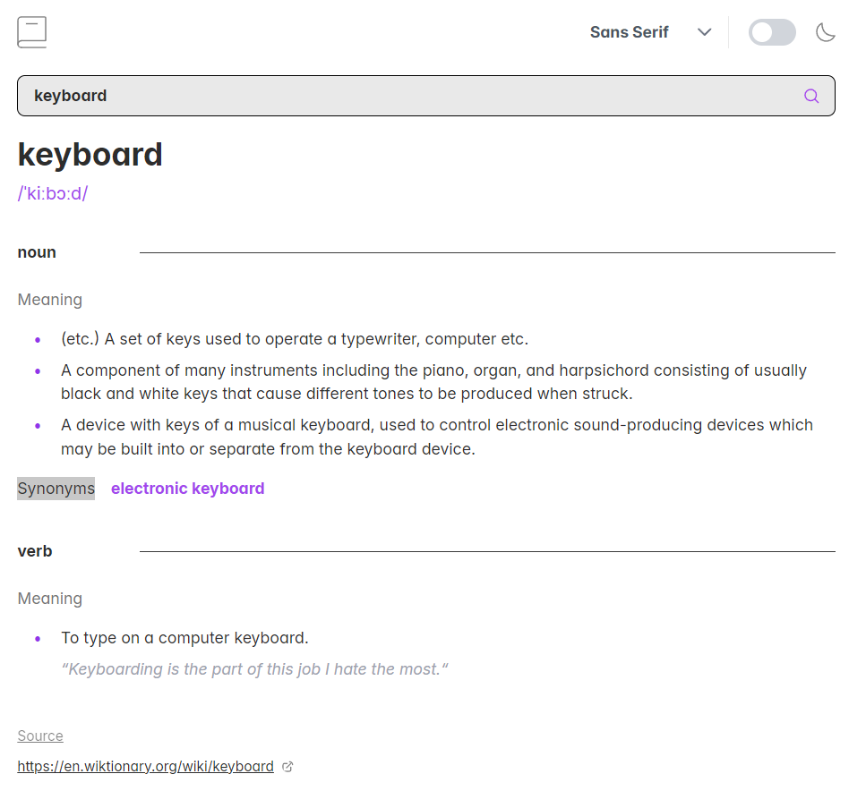

# Dictionary Web App

This project is a dictionary web app built using React and Next.js. It allows users to search for words and see definitions, synonyms, and antonyms. The app fetches data from the Free Dictionary API and presents it in a clean, mobile-first design with dark mode and font customization features.

## Table of Contents

- [Dictionary Web App](#dictionary-web-app)
  - [Table of Contents](#table-of-contents)
  - [Overview](#overview)
    - [The Challenge](#the-challenge)
    - [Screenshot](#screenshot)
    - [Links](#links)
  - [My Process](#my-process)
    - [Built With](#built-with)
    - [What I Learned](#what-i-learned)
    - [Continued Development](#continued-development)
    - [Useful Resources](#useful-resources)
  - [Author](#author)
  - [Acknowledgments](#acknowledgments)

## Overview

### The Challenge

Users should be able to:

- Search for words and see the Free Dictionary API's response, including definitions, synonyms, antonyms, and phonetic pronunciations.
- Play the audio pronunciation of the word (when available).
- See a validation message if a blank search is attempted.
- Switch between different font styles (Serif, Sans Serif, Mono).
- Toggle between light and dark mode.
- View a responsive layout optimized for all screen sizes.
- **Bonus**: Automatically detect and apply the correct color scheme based on system preferences.

### Screenshot



### Links

- [Solution URL](https://github.com/Skyz03/Next-Dictionary-app)
- [Live Site URL](https://next-dictionary-app-one.vercel.app)

## My Process

### Built With

- Semantic HTML5 markup
- CSS custom properties
- Flexbox
- Tailwind CSS for utility-first styling
- React for building the UI
- Next.js for SSR and routing
- PrimeReact for UI components
- Mobile-first workflow
- Free Dictionary API for fetching word data

### What I Learned

While working on this project, I improved my understanding of API integrations in Next.js and React. I also learned how to handle edge cases such as empty search queries, display audio pronunciations, and switch between light and dark themes. Here's an example of how I managed the search:

```js
const handleSearch = useCallback(async (searchTerm) => {
  setLoading(true);
  setError(null);

  try {
    const result = await fetchWordDefinition(searchTerm); // API call
    setDefinition(result?.[0] || null); // Handle no results
    if (!result || result.length === 0) {
      setError("Word not found.");
    }
  } catch (err) {
    setError("An error occurred while fetching the word.");
  } finally {
    setLoading(false);
  }
}, []);
```

### Continued Development

In future iterations, I would like to:

- Add a favorites feature where users can save frequently searched words.
- Enhance accessibility by improving keyboard navigation and screen reader support.
- Implement unit tests and integration tests for better maintainability.
- Improve performance by adding caching mechanisms for API responses.

### Useful Resources

- [MDN Web Docs - prefers-color-scheme](https://developer.mozilla.org/en-US/docs/Web/CSS/@media/prefers-color-scheme) - Helped me understand how to implement system-based dark mode.
- [React Documentation](https://reactjs.org/docs/getting-started.html) - General guidance on managing state and components.
- [Next.js Documentation](https://nextjs.org/docs) - Clear and concise documentation for server-side rendering and routing.

## Author

- Website - [Your Name](https://aakibshah.com.np)
- Frontend Mentor - [@Skyz03](https://www.frontendmentor.io/profile/Skyz03)

## Acknowledgments

Thanks to [Frontend Mentor](https://www.frontendmentor.io) for providing challenges that help developers like me to level up their skills.
